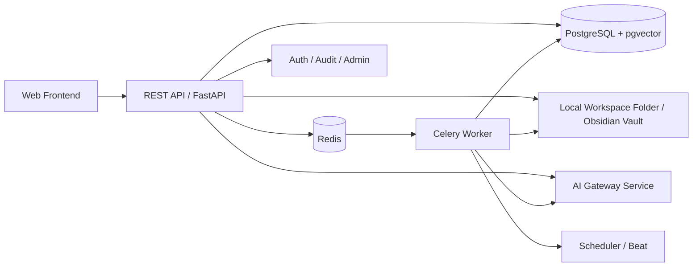

# 03-总体架构文档

## 1. 架构总览
系统采用**前后端分离 + 异步任务 + 文件系统/数据库双存储**架构。

## 2. 子系统
### 2.1 Web Frontend
- React SPA
- 三大模块：笔记、复习、设置
- 根据角色动态禁用操作
- 提供 Markdown+HTML+Mermaid 阅读体验

### 2.2 API Backend
- FastAPI 版本化 REST API
- 鉴权、业务编排、任务创建、文件索引管理
- 暴露管理接口与只读接口

### 2.3 Worker
- 执行转写/OCR/总结/思维导图/Embedding/FSRS 衍生任务
- 与数据库和本地文件系统交互

### 2.4 Storage
- 本地文件夹：原始资料、Markdown 笔记、导出包、生成产物
- PostgreSQL：用户、任务、元数据、索引、日志、复习记录、配置
- Redis：任务队列与缓存

## 3. 核心数据流
### 3.1 笔记生成
导入资料 -> 创建 ingestion job -> 解析文件 -> 调用 STT/OCR/LLM -> 生成 Markdown -> 写入目标文件夹 -> 建立 note 记录 -> 切片与向量化 -> 可选生成知识点

### 3.2 复习
笔记/知识点 -> FSRS 卡片初始化 -> scheduler 生成待复习项 -> 用户评分 -> 更新 FSRS 状态 -> 写入 review_log -> 刷新下次到期时间

### 3.3 总结 / 思维导图
选定范围 -> 聚合内容 -> 调用 LLM -> 生成 Markdown / Mermaid -> 写入导出文件夹 + 数据库记录

## 4. 安全架构
- 仅管理员可修改系统状态
- 普通用户只读内容 + 写复习日志
- 工作目录访问受 allowlist 限制
- AI key 加密存储
- API 全量鉴权，记录审计日志

## 5. 部署拓扑
- `frontend` 容器
- `backend` 容器
- `worker` 容器
- `beat` 容器
- `postgres` 容器
- `redis` 容器
- 可挂载宿主机 Markdown/Vault 工作目录
